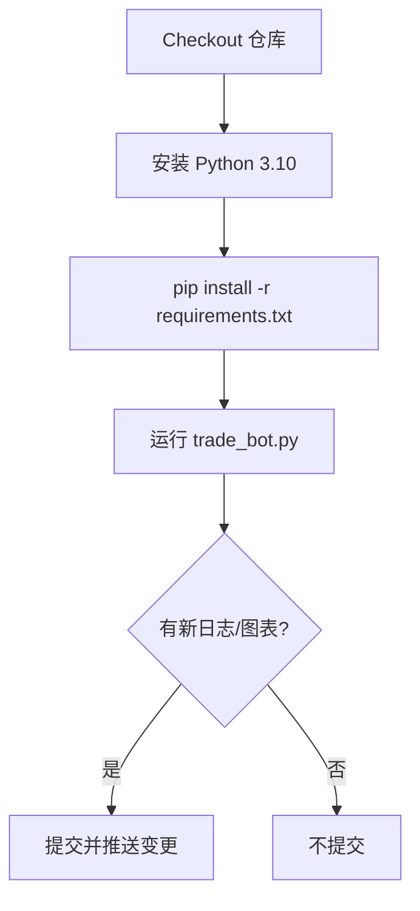

# AHR999 Dollar-Cost Averaging Bot

Automates a daily Bitcoin dollar-cost averaging strategy on OKX, enhanced with the AHR999 indicator and a rich visual dashboard.

## ✨ 项目亮点
- **智能买入**：基于 AHR999 指标动态调整每日投入金额，自动下单至 OKX 现货市场。
- **可视化面板**：自动生成 ROI 曲线、资产净值曲线以及投入成本对比图，帮助快速洞察投资表现。
- **运营日志**：所有成交记录保存在 `trade_log.csv`，支持复盘与数据分析。
- **GitHub 自动同步**：运行结果自动推送到仓库 Issue，便于团队追踪与审计。

## 🏗️ 技术栈
- Python 3.10+
- [ccxt](https://github.com/ccxt/ccxt)：统一访问加密货币交易所 API
- pandas / numpy：数据处理与指标计算
- matplotlib：生成多张高分辨率数据可视化图表
- requests：与 GitHub API 通信

## ⚙️ GitHub Action 自动化

### 🎯 什么是 GitHub Action？
GitHub Action 是 GitHub 提供的免费自动化服务，可以让你在云端自动运行代码，无需自己的服务器。这个项目已经配置好了自动化工作流，可以每天自动执行交易策略。

### 🚀 快速开始（新手必读）

#### 第一步：Fork 仓库
1. 点击仓库右上角的 **Fork** 按钮
2. 选择你的 GitHub 账号，创建副本
3. 现在你有了自己的交易机器人仓库

#### 第二步：配置 API 密钥
1. 进入你的仓库页面
2. 点击 **Settings** 标签页
3. 在左侧菜单找到 **Secrets and variables** → **Actions**
4. 点击 **New repository secret** 添加以下密钥：

**必须配置的密钥：**
- `OKX_API_KEY`：你的 OKX API 密钥
- `OKX_SECRET_KEY`：你的 OKX 密钥
- `OKX_PASSWORD`：你的 OKX 密码短语

**重要说明：**
- `GITHUB_TOKEN` **不需要手动配置**！GitHub 会自动提供，无需添加
- 所有密钥都是敏感信息，请妥善保管，不要分享给他人

#### 第三步：启用自动化
1. 进入 **Actions** 标签页
2. 找到 **Daily Investment Bot Runner** 工作流
3. 点击 **Enable workflow** 启用自动化

### 📅 运行方式

#### 自动运行（推荐）
- **默认时间**：每天北京时间上午 10:00 自动执行
- **修改时间**：如需调整，编辑 `.github/workflows/main.yml` 文件中的 `cron: '0 2 * * *'`
- **时区说明**：`0 2 * * *` 表示 UTC 时间凌晨 2 点，对应北京时间上午 10 点

#### 手动运行
1. 进入 **Actions** 标签页
2. 选择 **Daily Investment Bot Runner**
3. 点击 **Run workflow** 按钮
4. 选择分支（通常是 `main`）
5. 点击 **Run workflow** 立即执行

### 🔧 工作流程详解
每次运行时，机器人会：
1. 获取最新的比特币价格数据
2. 计算 AHR999 指标
3. 根据指标决定买入金额
4. 在 OKX 执行交易（如果满足条件）
5. 生成投资报告和图表
6. 自动提交结果到仓库
7. 在 GitHub Issue 中发布交易摘要

### 工作流步骤概览


> **提示**：工作流运行时会使用最新提交的代码，确保策略更新后的首个版本已推送到 `main` 分支。
## 🚀 本地运行（高级用户）

### 前置要求
- Python 3.10 或更高版本
- OKX 账户和 API 密钥
- Git（用于克隆仓库）

### 安装步骤

#### Windows 用户
```powershell
# 1. 克隆仓库
git clone https://github.com/xunyoyo/DCA-with-ahr999.git
cd DCA-with-ahr999

# 2. 创建虚拟环境（推荐）
python -m venv .venv
.\.venv\Scripts\Activate.ps1

# 3. 安装依赖
pip install --upgrade pip
pip install -r requirements.txt

# 4. 配置环境变量
$env:OKX_API_KEY     = "你的OKX_API_KEY"
$env:OKX_SECRET_KEY  = "你的OKX_SECRET_KEY"
$env:OKX_PASSWORD    = "你的OKX_PASSWORD"
$env:GITHUB_REPOSITORY = "你的用户名/仓库名"
$env:GITHUB_TOKEN      = "你的GitHub个人访问令牌"

# 5. 运行机器人
python trade_bot.py
```

#### macOS/Linux 用户
```bash
# 1. 克隆仓库
git clone https://github.com/xunyoyo/DCA-with-ahr999.git
cd DCA-with-ahr999

# 2. 创建虚拟环境（推荐）
python3 -m venv .venv
source .venv/bin/activate

# 3. 安装依赖
pip install --upgrade pip
pip install -r requirements.txt

# 4. 配置环境变量
export OKX_API_KEY="你的OKX_API_KEY"
export OKX_SECRET_KEY="你的OKX_SECRET_KEY"
export OKX_PASSWORD="你的OKX_PASSWORD"
export GITHUB_REPOSITORY="你的用户名/仓库名"
export GITHUB_TOKEN="你的GitHub个人访问令牌"

# 5. 运行机器人
python trade_bot.py
```

### 🔐 获取 OKX API 密钥
1. 登录 [OKX](https://www.okx.com) 账户
2. 进入 **账户** → **API** → **创建API密钥**
3. 选择 **只读** 和 **交易** 权限
4. 设置 IP 白名单（可选，但推荐）
5. 记录生成的 API Key、Secret Key 和 Passphrase

### 🔑 获取 GitHub 个人访问令牌
1. 进入 GitHub **Settings** → **Developer settings** → **Personal access tokens** → **Tokens (classic)**
2. 点击 **Generate new token (classic)**
3. 选择 **repo** 权限（完整仓库访问）
4. 生成并复制令牌（只显示一次，请妥善保存）

> **⚠️ 安全提醒**：
> - 不要在代码中硬编码 API 密钥
> - 使用环境变量或 `.env` 文件管理敏感信息
> - 定期轮换 API 密钥
> - 限制 API 密钥的权限范围

## 📈 使用方法
1. 按上述步骤运行 `trade_bot.py`。程序会：
   - 拉取 OKX 现货 BTC/USDT 日线数据；
   - 计算 AHR999 指数并确定当日投入金额；
   - 若条件满足，提交市价买单并记录成交信息；
   - 更新 `trade_log.csv` 并生成三张图表：`roi_chart.png`、`equity_curve.png`、`value_vs_cost.png`；
   - 向 GitHub Issue 推送本次运行的摘要报告。
2. 想切换图表风格，可在运行前设置环境变量 `DCA_CHART_THEME`：
   - `light`（默认）：简约白底风格
   - `midnight`：暗黑仪表盘风格
   - `neon`：科技感霓虹风格
3. 图表与日志生成在项目根目录，可用于周报、复盘或进一步分析。

## 📂 项目结构
```
DCA-with-ahr999/
├── trade_bot.py        # 主程序，含策略逻辑与可视化
├── trade_log.csv       # 运行后生成的成交日志
├── requirements.txt    # Python 依赖列表
├── roi_chart.png       # ROI 曲线图（运行后生成）
├── equity_curve.png    # 资产净值曲线（运行后生成）
└── value_vs_cost.png   # 投入成本 vs. 当前价值图（运行后生成）
```

## ❓ 常见问题解答

### Q: GitHub Action 运行失败怎么办？
**A:** 检查以下几点：
1. **API 密钥配置**：确保在仓库 Secrets 中正确配置了 OKX 的 API 密钥
2. **权限问题**：确认 API 密钥有交易权限
3. **网络问题**：GitHub Action 可能因为网络问题无法访问 OKX API
4. **查看日志**：在 Actions 页面点击失败的运行，查看详细错误信息

### Q: 机器人没有执行交易？
**A:** 可能的原因：
1. **AHR999 指标不满足买入条件**：这是正常现象，机器人只在合适的时机买入
2. **账户余额不足**：检查 OKX 账户 USDT 余额
3. **API 权限不足**：确认 API 密钥有交易权限
4. **市场时间**：某些时段可能无法交易

### Q: 如何修改投资金额？
**A:** 可以通过以下方式调整：
1. **环境变量**：设置 `BASELINE_INVESTMENT` 环境变量
2. **修改代码**：编辑 `trade_bot.py` 中的默认值
3. **GitHub Secrets**：在仓库 Secrets 中添加 `BASELINE_INVESTMENT`

### Q: 图表没有生成？
**A:** 检查：
1. **依赖安装**：确保 matplotlib 等依赖正确安装
2. **权限问题**：确认有写入文件的权限
3. **运行环境**：某些环境可能不支持图形界面

### Q: 如何停止自动化？
**A:** 两种方法：
1. **禁用工作流**：在 Actions 页面禁用 "Daily Investment Bot Runner"
2. **删除 Secrets**：删除 OKX API 密钥（机器人会因认证失败而停止）

### Q: 安全风险如何防范？
**A:** 建议措施：
1. **限制 API 权限**：只授予必要的交易权限
2. **设置 IP 白名单**：限制 API 密钥的使用范围
3. **小额测试**：先用小金额测试，确认无误后再增加投资
4. **定期检查**：定期查看交易记录和账户状态

## 🛠️ 故障排除

### 错误：`ModuleNotFoundError: No module named 'ccxt'`
**解决方案**：重新安装依赖
```bash
pip install -r requirements.txt
```

### 错误：`Authentication failed`
**解决方案**：检查 API 密钥配置
1. 确认密钥正确复制（无多余空格）
2. 检查密钥是否过期
3. 确认密钥权限设置正确

### 错误：`Insufficient balance`
**解决方案**：检查账户余额
1. 登录 OKX 确认 USDT 余额充足
2. 检查是否有未完成的订单占用资金

### 错误：`GitHub API rate limit exceeded`
**解决方案**：等待一段时间后重试，或检查 GitHub 令牌权限

## 🤝 贡献指南
1. Fork 仓库并新建分支（如 `feature/my-awesome-improvement`）
2. 为新功能编写必要的文档或测试
3. 运行静态检查或单元测试，确保通过
4. 提交 Pull Request，说明变更动机与实现细节

## 📄 许可证
本项目采用 [MIT License](./LICENSE) 授权，细节请参阅许可证文本。

## 📞 获取帮助
- **提交 Issue**：遇到问题时，请在 GitHub 仓库提交 Issue
- **查看文档**：仔细阅读本 README 和代码注释
- **社区讨论**：欢迎在 Issues 中讨论策略改进和功能建议

---
**⚠️ 风险提示**：加密货币投资存在风险，请根据自身风险承受能力谨慎投资。本工具仅供学习和研究使用，不构成投资建议。

欢迎提交 Issue 或 PR 与我们交流想法，祝你投资顺利！ 🚀
