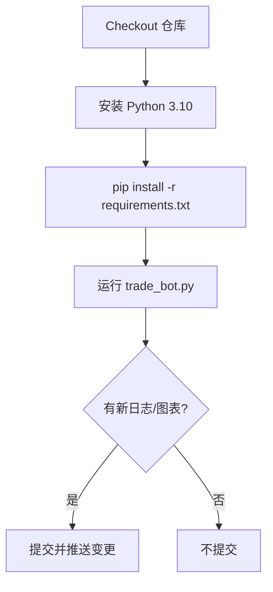

# AHR999 智能定投机器人


基于 AHR999 指标的比特币智能定投策略，在 OKX 交易所自动执行每日定投，并提供丰富的可视化数据仪表盘。

## ✨ 项目亮点
- **智能买入**：基于 AHR999 指标动态调整每日投入金额，自动下单至 OKX 现货市场。
- **综合仪表盘**：自动生成包含 7 个可视化图表的综合仪表盘，全方位展示投资表现：
  - ROI 投资回报曲线
  - 资产净值增长曲线
  - 投入成本 vs 当前价值对比
  - 每日投资额动态变化
  - BTC 累积持仓走势
  - 平均成本 vs 实时价格
  - 智能定投 vs 普通定投策略对比
- **多种图表主题**：支持三种精美主题（简约白底、暗黑仪表盘、科技霓虹），满足不同审美需求。
- **运营日志**：所有成交记录保存在 `trade_log.csv`，支持复盘与数据分析。
- **GitHub 自动同步**：运行结果自动推送到仓库 Issue，便于团队追踪与审计。

## 🏗️ 技术栈
- **Python 3.10+**：现代化的 Python 开发环境
- **[ccxt](https://github.com/ccxt/ccxt)**：统一访问加密货币交易所 API
- **pandas / numpy**：高性能数据处理与科学计算
- **matplotlib**：生成高分辨率数据可视化图表
- **scipy**：样条插值算法，实现平滑曲线效果
- **requests**：与 GitHub API 通信，自动推送运行报告

## ⚙️ GitHub Action 自动化

### 🎯 什么是 GitHub Action？
GitHub Action 是 GitHub 提供的免费自动化服务，可以让你在云端自动运行代码，无需自己的服务器。这个项目已经配置好了自动化工作流，可以每天自动执行交易策略。

### 🚀 快速开始（新手必读）

> **💡 适合对象**：完全不懂编程的新手也能 5 分钟完成配置！  
> **⏱️ 预计时间**：首次配置约 10-15 分钟（含 OKX API 申请）  
> **💰 成本**：完全免费！GitHub Actions 提供免费额度，足够每日运行

---

#### 🔰 前置准备

在开始之前，请确保你已经：

- ✅ 拥有 GitHub 账号（[点击注册](https://github.com/signup)，完全免费）
- ✅ 拥有 OKX 账户（[点击注册](https://www.okx.com)）
- ✅ 注册时建议填写本人邀请码**>35373898<**手续费反佣20%
- ✅ OKX 账户中有 USDT 余额（建议至少 $20 以上，用于定投）
- ✅ 已完成 OKX 身份验证（KYC）

---

#### 第一步：Fork（复制）本仓库到你的账号

**操作步骤：**

1. **点击右上角 Fork 按钮**  
   在本仓库页面右上角，找到并点击 **"Fork"** 按钮（星标旁边）

2. **选择你的账号**  
   在弹出页面中，选择你的 GitHub 账号作为目标

3. **等待复制完成**  
   几秒钟后，你的账号下就会有一个完整的副本仓库

4. **验证成功**  
   浏览器地址栏应该显示：`github.com/你的用户名/DCA-with-ahr999`

> **📌 为什么要 Fork？**  
> Fork 后这个机器人就完全属于你了，你可以自由修改参数、查看运行记录，而不会影响原仓库。

---

#### 第二步：获取 OKX API 密钥

**详细操作流程：**

1. **登录 OKX 并进入 API 管理页面**
   - 登录 [OKX](https://www.okx.com)
   - 点击右上角头像 → **API**
   - 或直接访问：https://www.okx.com/account/my-api

2. **创建新的 API 密钥**
   - 点击 **"创建 API"** 按钮
   - 选择 API 类型：**交易 API**（Trade API）

3. **配置 API 权限（重要！）**
   - ✅ **读取**（Read）：必须勾选
   - ✅ **交易**（Trade）：必须勾选
   - ❌ **提现**（Withdraw）：**不要勾选**（安全考虑）
   - 备注名称：可填写 "DCA Bot" 便于识别

4. **设置 IP 白名单（可选但推荐）**
   - 如果不确定，可以先选择 **"无限制"**
   - 后期可以添加 GitHub Actions 的 IP 范围以提高安全性

5. **设置密码短语（Passphrase）**
   - 输入一个自定义的密码短语（6-32位字符）
   - **务必记录下来**，后面会用到！

6. **完成安全验证**
   - 输入资金密码、邮箱验证码、手机验证码等
   - 点击 **"确认"**

7. **复制并保存三个密钥**  
   ⚠️ **关键步骤：这些信息只显示一次，务必立即保存！**
   - **API Key**（以 `xxx` 开头的长字符串）
   - **Secret Key**（以 `xxx` 开头的长字符串）
   - **Passphrase**（你刚才设置的密码短语）

> **🔒 安全提示**：
> - 将这三个密钥保存到密码管理器或安全的地方
> - 不要分享给任何人
> - 不要截图发到社交媒体
> - 如果泄露，立即在 OKX 删除该 API 并重新创建

---

#### 第三步：在 GitHub 中配置密钥

**详细操作流程：**

1. **进入你 Fork 的仓库**
   - 确保地址栏是：`github.com/你的用户名/DCA-with-ahr999`

2. **打开设置页面**
   - 点击仓库顶部的 **"Settings"**（设置）标签
   - ⚠️ 如果看不到 Settings，说明你不在自己 Fork 的仓库

3. **进入 Secrets 管理**
   - 在左侧菜单找到 **"Secrets and variables"**
   - 点击展开，选择 **"Actions"**

4. **添加第一个密钥：OKX_API_KEY**
   - 点击右上角 **"New repository secret"** 按钮
   - **Name（名称）**：输入 `OKX_API_KEY`（必须完全一致，区分大小写）
   - **Secret（值）**：粘贴你的 OKX API Key
   - 点击 **"Add secret"**

5. **添加第二个密钥：OKX_SECRET_KEY**
   - 再次点击 **"New repository secret"**
   - **Name**：输入 `OKX_SECRET_KEY`
   - **Secret**：粘贴你的 OKX Secret Key
   - 点击 **"Add secret"**

6. **添加第三个密钥：OKX_PASSWORD**
   - 再次点击 **"New repository secret"**
   - **Name**：输入 `OKX_PASSWORD`
   - **Secret**：粘贴你的 OKX Passphrase（密码短语）
   - 点击 **"Add secret"**

7. **验证配置完成**
   - 你应该看到三个 Secrets：
     - `OKX_API_KEY`
     - `OKX_SECRET_KEY`
     - `OKX_PASSWORD`
   - ✅ 绿色对勾表示配置成功

8. **（可选）配置每日投资金额**
   - 如果想自定义每日基准投资金额，可以添加：
   - **Name**：输入 `BASELINE_INVESTMENT`
   - **Secret**：输入金额数字（如 `10` 表示每日基准 $10）
   - 如果不配置，默认使用 **$5.0**

9. **（可选）配置图表主题**
   - 如果想自定义图表主题，可以添加：
   - **Name**：输入 `DCA_CHART_THEME`
   - **Secret**：输入主题名称（`light`、`midnight` 或 `neon`）
   - 如果不配置，默认使用 **light** 主题

> **💡 常见问题**：
> - **Q: 需要配置 GITHUB_TOKEN 吗？**  
>   A: **不需要！** GitHub 会自动提供，手动添加反而会出错。
> 
> - **Q: 密钥可以修改吗？**  
>   A: 可以！点击密钥名称 → Remove → 重新添加即可。
> 
> - **Q: 为什么看不到密钥的值？**  
>   A: 这是 GitHub 的安全机制，添加后无法查看，只能删除重建。
> 
> - **Q: BASELINE_INVESTMENT 设置多少合适？**  
>   A: 建议根据个人财务状况设置，新手可以从 $5-$10 开始，熟悉后可以调整。

---

#### 第四步：启用 GitHub Actions 自动化

**详细操作流程：**

1. **进入 Actions 页面**
   - 点击仓库顶部的 **"Actions"** 标签

2. **启用工作流（首次需要）**
   - 如果看到绿色提示 *"Workflows aren't being run on this forked repository"*
   - 点击 **"I understand my workflows, go ahead and enable them"** 按钮

3. **找到定投机器人工作流**
   - 在左侧列表找到 **"Daily Investment Bot Runner"**
   - 点击进入该工作流

4. **启用工作流**
   - 如果右上角有 **"Enable workflow"** 按钮，点击启用
   - 如果没有此按钮，说明已经启用

5. **首次手动测试运行（推荐）**
   - 点击右上角 **"Run workflow"** 按钮
   - 在弹出框中：
     - 选择分支：**main**（默认）
     - 点击绿色 **"Run workflow"** 按钮

6. **查看运行结果**
   - 等待 1-2 分钟，页面会显示运行进度
   - 点击运行记录可以查看详细日志
   - ✅ 绿色对勾：运行成功
   - ❌ 红色叉号：运行失败（检查 API 密钥配置）

7. **检查运行结果**
   - 运行成功后，检查以下内容：
     - 仓库中出现 `trade_log.csv` 文件（交易记录）
     - 仓库中出现 `dashboard_comprehensive.png` 文件（图表）
     - **Issues** 标签页出现一个新的汇报 Issue

> **🎉 恭喜！** 如果首次测试运行成功，说明配置完全正确！

---

#### 第五步：设置自动运行（可选配置）

**默认配置：**
- 机器人会在每天 **北京时间上午 10:00** 自动运行
- 对应 UTC 时间 02:00（已配置在工作流中）

**如需修改运行时间：**

1. **编辑工作流文件**
   - 进入仓库，点击 `.github/workflows/main.yml` 文件
   - 点击右上角 **铅笔图标**（Edit this file）

2. **修改 cron 表达式**
   - 找到这一行：`cron: '0 2 * * *'`
   - 修改为你想要的时间（使用 UTC 时区）

3. **时间对照表**
   | 北京时间 | UTC时间 | cron 表达式 |
   |---------|---------|------------|
   | 上午 8:00 | 00:00 | `'0 0 * * *'` |
   | 上午 10:00 | 02:00 | `'0 2 * * *'` |
   | 中午 12:00 | 04:00 | `'0 4 * * *'` |
   | 下午 18:00 | 10:00 | `'0 10 * * *'` |
   | 晚上 22:00 | 14:00 | `'0 14 * * *'` |

4. **提交修改**
   - 点击 **"Commit changes"**
   - 填写提交说明（如："修改运行时间为中午12点"）
   - 点击 **"Commit changes"** 确认

> **📌 提示**：  
> cron 表达式格式：`'分钟 小时 日 月 星期'`  
> 例如：`'30 2 * * *'` = 每天 UTC 02:30（北京时间 10:30）

---

#### ✅ 配置完成检查清单

在完成所有步骤后，请确认：

- [ ] 已成功 Fork 仓库到自己账号
- [ ] 已在 OKX 创建 API 密钥（交易权限，无提现权限）
- [ ] 已在 GitHub Secrets 中添加三个密钥
- [ ] 已启用 GitHub Actions 工作流
- [ ] 已成功运行一次测试（绿色对勾）
- [ ] 仓库中出现 `trade_log.csv` 和 `dashboard_comprehensive.png`
- [ ] Issues 中出现运行汇报

**🎊 全部打勾？恭喜你成功部署了自动定投机器人！**

---

#### 📊 后续使用

配置完成后，机器人会：
1. **每天自动运行**：在设定时间自动执行
2. **自动买入 BTC**：根据 AHR999 指标智能调整买入金额
3. **记录交易日志**：所有交易保存在 `trade_log.csv`
4. **生成可视化图表**：每次运行更新综合仪表盘
5. **推送运行报告**：在 Issues 中查看每日汇报

### 📅 运行方式

#### 自动运行（推荐）
- **默认时间**：每天北京时间上午 10:00 自动执行
- **修改时间**：如需调整，编辑 `.github/workflows/main.yml` 文件中的 `cron: '0 2 * * *'`
- **时区说明**：`0 2 * * *` 表示 UTC 时间凌晨 2 点，对应北京时间上午 10 点

#### 手动运行
1. 进入 **Actions** 标签页
2. 选择 **Daily Investment Bot Runner**
3. 点击 **Run workflow** 按钮
4. 选择分支（通常是 `main`）
5. 点击 **Run workflow** 立即执行

### 🔧 工作流程详解
每次运行时，机器人会：
1. 获取最新的比特币价格数据
2. 计算 AHR999 指标
3. 根据指标决定买入金额
4. 在 OKX 执行交易（如果满足条件）
5. 生成投资报告和图表
6. 自动提交结果到仓库
7. 在 GitHub Issue 中发布交易摘要

### 工作流步骤概览


> **提示**：工作流运行时会使用最新提交的代码，确保策略更新后的首个版本已推送到 `main` 分支。
## 🚀 本地运行（高级用户）

### 前置要求
- Python 3.10 或更高版本
- OKX 账户和 API 密钥
- Git（用于克隆仓库）

### 安装步骤

#### Windows 用户
```powershell
# 1. 克隆仓库
git clone https://github.com/xunyoyo/DCA-with-ahr999.git
cd DCA-with-ahr999

# 2. 创建虚拟环境（推荐）
python -m venv .venv
.\.venv\Scripts\Activate.ps1

# 3. 安装依赖
pip install --upgrade pip
pip install -r requirements.txt

# 4. 配置环境变量（必需）
$env:OKX_API_KEY     = "你的OKX_API_KEY"
$env:OKX_SECRET_KEY  = "你的OKX_SECRET_KEY"
$env:OKX_PASSWORD    = "你的OKX_PASSWORD"
$env:GITHUB_REPOSITORY = "你的用户名/仓库名"
$env:GITHUB_TOKEN      = "你的GitHub个人访问令牌"

# （可选）自定义投资金额和图表主题
$env:BASELINE_INVESTMENT = "10"          # 默认 5.0
$env:DCA_CHART_THEME     = "midnight"    # 默认 light

# 5. 运行机器人
python trade_bot.py
```

#### macOS/Linux 用户
```bash
# 1. 克隆仓库
git clone https://github.com/xunyoyo/DCA-with-ahr999.git
cd DCA-with-ahr999

# 2. 创建虚拟环境（推荐）
python3 -m venv .venv
source .venv/bin/activate

# 3. 安装依赖
pip install --upgrade pip
pip install -r requirements.txt

# 4. 配置环境变量（必需）
export OKX_API_KEY="你的OKX_API_KEY"
export OKX_SECRET_KEY="你的OKX_SECRET_KEY"
export OKX_PASSWORD="你的OKX_PASSWORD"
export GITHUB_REPOSITORY="你的用户名/仓库名"
export GITHUB_TOKEN="你的GitHub个人访问令牌"

# （可选）自定义投资金额和图表主题
export BASELINE_INVESTMENT="10"          # 默认 5.0
export DCA_CHART_THEME="midnight"        # 默认 light

# 5. 运行机器人
python trade_bot.py
```

### 🔐 获取 OKX API 密钥
1. 登录 [OKX](https://www.okx.com) 账户
2. 进入 **账户** → **API** → **创建API密钥**
3. 选择 **只读** 和 **交易** 权限
4. 设置 IP 白名单（可选，但推荐）
5. 记录生成的 API Key、Secret Key 和 Passphrase

### 🔑 获取 GitHub 个人访问令牌
1. 进入 GitHub **Settings** → **Developer settings** → **Personal access tokens** → **Tokens (classic)**
2. 点击 **Generate new token (classic)**
3. 选择 **repo** 权限（完整仓库访问）
4. 生成并复制令牌（只显示一次，请妥善保存）

> **⚠️ 安全提醒**：
> - 不要在代码中硬编码 API 密钥
> - 使用环境变量或 `.env` 文件管理敏感信息
> - 定期轮换 API 密钥
> - 限制 API 密钥的权限范围

## 📈 使用方法
1. 按上述步骤运行 `trade_bot.py`。程序会：
   - 拉取 OKX 现货 BTC/USDT 日线数据；
   - 计算 AHR999 指数并确定当日投入金额；
   - 若条件满足，提交市价买单并记录成交信息；
   - 更新 `trade_log.csv` 并生成三张图表：`roi_chart.png`、`equity_curve.png`、`value_vs_cost.png`；
   - 向 GitHub Issue 推送本次运行的摘要报告。
2. 想切换图表风格，可在运行前设置环境变量 `DCA_CHART_THEME`：
   - `light`（默认）：简约白底风格
   - `midnight`：暗黑仪表盘风格
   - `neon`：科技感霓虹风格
3. 图表与日志生成在项目根目录，可用于周报、复盘或进一步分析。

## 📂 项目结构
```
DCA-with-ahr999/
├── .github/
│   └── workflows/
│       └── main.yml                    # GitHub Actions 自动化工作流配置
├── trade_bot.py                        # 主程序：策略逻辑 + 交易执行 + 可视化
├── requirements.txt                    # Python 依赖包列表
├── trade_log.csv                       # 历史交易日志（运行后生成）
├── dashboard_comprehensive.png         # 综合仪表盘图表（运行后生成）
├── README.md                           # 项目说明文档
└── LICENSE                             # MIT 开源许可证
```

### 核心文件说明

#### `trade_bot.py`
主程序文件，包含：
- **策略参数配置**：基准投资额、AHR999 参数、暂停阈值等
- **AHR999 指标计算**：200 日均价、指数增长估值模型
- **动态投资决策**：连续乘数计算、投资额调整逻辑
- **OKX 交易执行**：通过 ccxt 库执行市价买单
- **数据可视化**：7 个图表的绘制与主题配置
- **GitHub 集成**：自动创建 Issue 汇报运行结果

#### `trade_log.csv`
CSV 格式的交易历史记录，包含字段：
- `date`：交易日期（YYYY-MM-DD）
- `buy_usd`：买入金额（美元）
- `buy_btc`：买入数量（BTC）
- `price_usd`：成交价格（美元/BTC）

#### `dashboard_comprehensive.png`
高分辨率综合仪表盘（24×30 英寸 @ 300 DPI），包含：
- 顶部统计面板：投资总额、持仓数量、投资表现、当前价格、策略对比
- 7 个可视化图表：全方位展示投资数据和策略效果

## ❓ 常见问题解答

### Q: GitHub Action 运行失败怎么办？
**A:** 检查以下几点：
1. **API 密钥配置**：确保在仓库 Secrets 中正确配置了 OKX 的 API 密钥
2. **权限问题**：确认 API 密钥有交易权限
3. **网络问题**：GitHub Action 可能因为网络问题无法访问 OKX API
4. **查看日志**：在 Actions 页面点击失败的运行，查看详细错误信息

### Q: 机器人没有执行交易？
**A:** 可能的原因：
1. **AHR999 指标不满足买入条件**：这是正常现象，机器人只在合适的时机买入
2. **账户余额不足**：检查 OKX 账户 USDT 余额
3. **API 权限不足**：确认 API 密钥有交易权限
4. **市场时间**：某些时段可能无法交易

### Q: 如何修改投资金额？
**A:** 有三种方式调整每日基准投资金额（默认 $5）：

1. **GitHub Actions（推荐）**：
   - 进入仓库 **Settings** → **Secrets and variables** → **Actions**
   - 点击 **New repository secret**
   - Name：`BASELINE_INVESTMENT`
   - Secret：输入金额数字（如 `10` 表示每日基准 $10）
   - 保存后下次运行自动生效

2. **本地运行**：
   ```bash
   # Windows PowerShell
   $env:BASELINE_INVESTMENT = "10"
   python trade_bot.py
   
   # macOS/Linux
   export BASELINE_INVESTMENT="10"
   python trade_bot.py
   ```

3. **修改代码（不推荐）**：
   - 编辑 `trade_bot.py` 第 30 行的 `DEFAULT_BASELINE_INVESTMENT = 5.0`
   - 改为你想要的金额
   - 注意：代码修改会影响所有未来的更新

> **💡 提示**：机器人会根据 AHR999 指标自动调整实际投资金额（0-4倍基准金额），这里设置的是基准值。

### Q: 图表没有生成？
**A:** 检查：
1. **依赖安装**：确保 matplotlib、scipy 等依赖正确安装（`pip install -r requirements.txt`）
2. **数据量不足**：至少需要 2 天以上的交易记录才能生成图表
3. **权限问题**：确认有写入文件的权限
4. **运行环境**：某些环境可能不支持图形界面（GitHub Actions 已配置为无头模式）

### Q: 如何切换图表主题？
**A:** 三种方式：
1. **环境变量**（推荐）：设置 `DCA_CHART_THEME` 为 `light`、`midnight` 或 `neon`
2. **GitHub Actions**：在仓库 Settings → Secrets 中添加 `DCA_CHART_THEME`
3. **默认主题**：如不设置，默认使用 `light` 主题

### Q: 如何停止自动化？
**A:** 两种方法：
1. **禁用工作流**：在 Actions 页面禁用 "Daily Investment Bot Runner"
2. **删除 Secrets**：删除 OKX API 密钥（机器人会因认证失败而停止）

### Q: 安全风险如何防范？
**A:** 建议措施：
1. **限制 API 权限**：只授予必要的交易权限
2. **设置 IP 白名单**：限制 API 密钥的使用范围
3. **小额测试**：先用小金额测试，确认无误后再增加投资
4. **定期检查**：定期查看交易记录和账户状态

### Q: Fork 后如何保护个人交易隐私？
**A:** 如果你 Fork 了本仓库，建议采取以下措施保护交易隐私：
1. **清空历史记录**：首次运行前，清空 `trade_log.csv` 内容（只保留表头 `date,buy_usd,buy_btc,price_usd`）
2. **添加到 .gitignore**：将 `trade_log.csv` 和 `*.png` 添加到 `.gitignore` 文件，避免提交个人数据
3. **使用私有仓库**：将 Fork 的仓库设为 Private，完全保护隐私

> **💡 提示**：本仓库的 `trade_log.csv` 包含原作者的测试数据，建议 Fork 后立即清空。

## 🛠️ 故障排除

### 错误：`ModuleNotFoundError: No module named 'ccxt'`
**解决方案**：重新安装依赖
```bash
pip install -r requirements.txt
```

### 错误：`Authentication failed`
**解决方案**：检查 API 密钥配置
1. 确认密钥正确复制（无多余空格）
2. 检查密钥是否过期
3. 确认密钥权限设置正确

### 错误：`Insufficient balance`
**解决方案**：检查账户余额
1. 登录 OKX 确认 USDT 余额充足
2. 检查是否有未完成的订单占用资金

### 错误：`GitHub API rate limit exceeded`
**解决方案**：等待一段时间后重试，或检查 GitHub 令牌权限

## 🤝 贡献指南
1. Fork 仓库并新建分支（如 `feature/my-awesome-improvement`）
2. 为新功能编写必要的文档或测试
3. 运行静态检查或单元测试，确保通过
4. 提交 Pull Request，说明变更动机与实现细节

## 📄 许可证
本项目采用 [MIT License](./LICENSE) 授权，细节请参阅许可证文本。

## 📞 获取帮助
- **提交 Issue**：遇到问题时，请在 GitHub 仓库提交 Issue
- **查看文档**：仔细阅读本 README 和代码注释
- **社区讨论**：欢迎在 Issues 中讨论策略改进和功能建议

---
**⚠️ 风险提示**：加密货币投资存在风险，请根据自身风险承受能力谨慎投资。本工具仅供学习和研究使用，不构成投资建议。

欢迎提交 Issue 或 PR 与我们交流想法，祝你投资顺利！ 🚀
